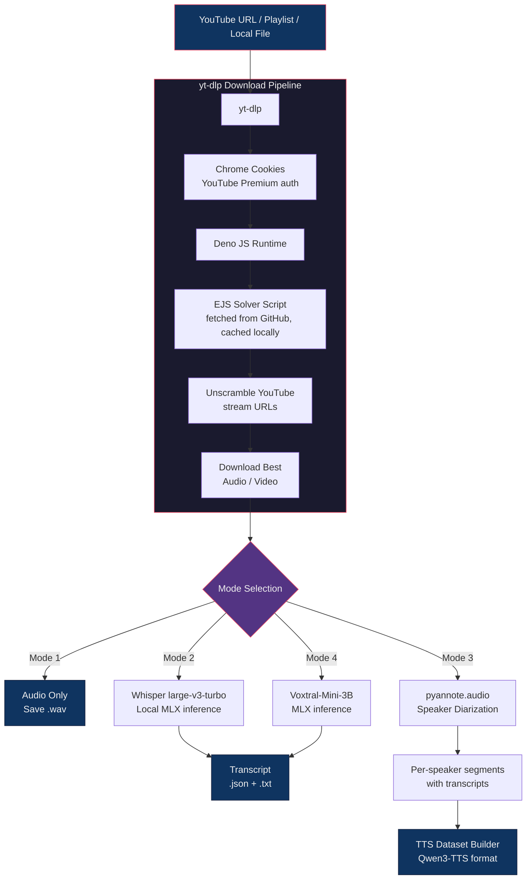

# MLX-YouTubeScribe

> **Note**: This application uses local AI models for transcription. The models will be automatically downloaded the first time you run the application. Please ensure you have a stable internet connection for the initial setup.

A powerful application that generates transcripts from YouTube videos and playlists using local Whisper AI models for speech recognition. The application processes audio from YouTube videos, analyzes the audio characteristics, and generates accurate text transcripts completely offline after the initial model download.

## How It Works



## Features

- **Video & Playlist Support**: Process individual YouTube videos, playlists, Radio/Mix playlists, or local video files
- **Multiple Transcription Modes**:
  - **Mode 1** — Audio only (download without transcription)
  - **Mode 2** — Audio + Transcription (local Whisper, default)
  - **Mode 3** — Speaker diarization + TTS dataset preparation (using pyannote.audio)
  - **Mode 4** — Audio + Voxtral transcription (using Voxtral-Mini-3B via MLX)
- **Apple Silicon Optimized**: Whisper runs on the Apple GPU via mlx-whisper (Metal). Demucs and pyannote still use PyTorch MPS.
- **YouTube Premium Support**: Uses browser cookies for authenticated downloads (highest available audio quality)
- **TTS Dataset Utilities**: Build Qwen3-TTS fine-tuning datasets from diarized segments or raw WAV recordings
- **OpenAI API Variant**: Alternative transcription backend using OpenAI's Whisper API instead of local models
- **Batch Processing**: Automatically processes all videos in a playlist or all files in a local directory
- **Output Formats**: Saves results in both JSON and human-readable text formats

## Prerequisites

- Python 3.8 or higher
- macOS with Apple Silicon (M1/M2) for optimal performance with MLX and PyTorch MPS
- FFmpeg (required by yt-dlp for audio extraction)
- Deno (required by yt-dlp to solve YouTube's stream URL challenges)

## Installation

1. Clone the repository:
   ```bash
   git clone <repository-url>
   cd Transcriptor
   ```

2. Create and activate a conda environment:
   ```bash
   # Create a new conda environment with Python 3.8 or higher
   conda create -n transcriptor python=3.9
   conda activate transcriptor
   ```

3. Install the required packages:
   ```bash
   # Install PyTorch with Metal Performance Shaders (MPS) support for Apple Silicon
   conda install pytorch::pytorch torchvision torchaudio -c pytorch
   
   # Install remaining dependencies
   conda install -c conda-forge streamlit yt-dlp numpy scipy
   
   # Install MLX for Apple Silicon acceleration
   pip install mlx mlx-whisper
   
   # Install transformers (diarization / Demucs still use PyTorch)
   pip install transformers[torch]
   ```

4. Install external dependencies:
   ```bash
   brew install ffmpeg
   brew install deno
   ```
   - **FFmpeg**: Required by yt-dlp for audio extraction and conversion.
   - **Deno**: JavaScript runtime used by yt-dlp to solve YouTube's URL challenges. YouTube encrypts/scrambles the download URLs for audio and video streams. To unscramble them, yt-dlp needs to run the same JavaScript that YouTube's web player runs in your browser. Deno executes that code locally on your Mac. On first run, yt-dlp also downloads a small open-source solver script from the [yt-dlp/ejs](https://github.com/yt-dlp/ejs) GitHub repo (cached locally after that). Nothing about your account is sent to GitHub — it's just fetching a public script. Your cookies only go to YouTube.

## Usage

### Main CLI (Local Whisper / Voxtral)

```bash
python src/main_langgraph.py
```

Interactive prompts will ask for a YouTube URL (or local file/folder path), mode selection, and optional video download. You can also pass arguments directly:

```bash
# Single video with default mode (Audio + Transcription)
python src/main_langgraph.py -u "https://youtube.com/watch?v=..."

# Playlist, audio-only download
python src/main_langgraph.py -u "https://youtube.com/playlist?list=..." -m 1

# Speaker diarization + TTS
python src/main_langgraph.py -u "https://youtube.com/watch?v=..." -m 3

# Voxtral transcription
python src/main_langgraph.py -u "https://youtube.com/watch?v=..." -m 4

# Local video file or folder
python src/main_langgraph.py -f /path/to/video.mp4
python src/main_langgraph.py -d /path/to/videos/
```

### Transcribe a local M4A file

Use the focused M4A CLI when you already have an audio file and only need its
transcription. The transcript is printed to stdout:

```bash
python src/transcribe_m4a.py /path/to/audio.m4a
```

### Drop-folder MoM pipeline (daily use)

For meeting audio (`.m4a`) you want transcribed **and** turned into Minutes of
Meeting markdown via local oMLX:

1. Drop files into `~/Desktop/AudioToMoM/`
2. Start oMLX with your DeepSeek model loaded
3. Run (no file arguments needed):

```bash
./run_mom_inbox.sh
# or:
conda run -n youtube python src/mom_from_audio.py
```

Outputs land in `~/Desktop/AudioToMoM/output/`:

- `*.transcript.txt` — raw Whisper transcript  
- `*.mom.md` — Minutes of Meeting with action items  

**Skip already-processed audio:** content is hashed (SHA-256). The same file is
never transcribed or MoM’d twice, even if you rename it. State lives in
`~/Desktop/AudioToMoM/.processed.json`. Use `--force` to re-run.

**Memory order:** all Whisper transcriptions first (one model load), then all
oMLX MoMs — so Whisper and DeepSeek are not loaded at the same time.

| Env / flag | Default | Purpose |
| --- | --- | --- |
| `MOM_INBOX_DIR` / `--inbox` | `~/Desktop/AudioToMoM` | Drop folder |
| `OMLX_BASE_URL` / `--omlx-base-url` | `http://127.0.0.1:8000/v1` | oMLX OpenAI-compatible API |
| `OMLX_MODEL` / `--omlx-model` | `DeepSeek-V4-Flash-0731-MXFP4-MLX` | Model id as listed by oMLX |
| `OMLX_API_KEY` / `--omlx-api-key` | from `~/.omlx/settings.json` | Bearer token for oMLX |
| `--skip-mom` | off | Transcript only |
| `--force` | off | Reprocess despite registry |

MoM system prompt: `prompts/mom_system.md` (edit freely).

Write the transcript to a text file instead:

```bash
python src/transcribe_m4a.py /path/to/audio.m4a --output transcript.txt
```

Or use the setup wrapper to create/reuse `.venv`, install the focused Python
dependencies, ensure FFmpeg is available, and run the transcription. The
wrapper requires Python 3.9 or newer:

```bash
./setup_and_run_audio_transcription.sh /path/to/audio.m4a --output transcript.txt
```

The command uses `mlx-community/whisper-large-v3-turbo` via mlx-whisper on
the Apple GPU (Metal), defaults to English (matching the main pipeline), and
accepts `--language` for other Whisper languages.

### OpenAI API Variant

Uses the OpenAI Whisper API instead of local models. Works on any machine (no GPU required), but requires an API key:

```bash
export OPENAI_API_KEY='sk-...'
python src/main_langgraph_openai.py
```

Same CLI interface as the main version. Supports all input types (URLs, playlists, local files) but only transcription mode — no diarization or Voxtral.

### TTS Dataset Utilities

Two utilities for building [Qwen3-TTS](https://github.com/QwenLM/Qwen3-TTS) fine-tuning datasets:

**From diarization output** (after running mode 3):
```bash
python src/utils/create_tts_dataset.py --source ./output/speaker_name --output ./dataset
```
Reads speaker segments and transcripts from video JSON files produced by the diarization pipeline. No additional transcription needed.

**From raw WAV recordings**:
```bash
python src/utils/create_tts_dataset_from_wavs.py --source /path/to/wavs --output ./dataset --speaker my_voice
```
Transcribes each WAV file using local Whisper, then builds the dataset. Use this to clone your own voice from your own recordings.

Both produce:
- `audio/` folder with renamed utterances + a reference clip (`ref.wav`)
- `train_raw.jsonl` in the format Qwen3-TTS expects
- `dataset_info.json` with stats
- `test_inference.py` scaffold script

## Output

The application creates an `output` directory with the following structure:

```
output/
├── [video_title].json     # Complete analysis in JSON format
├── [video_title].txt      # Human-readable transcript
└── audio/
    └── [video_title].wav  # Downloaded audio file
```

For playlists, a subdirectory with the playlist name is created containing all video transcripts.

## Models

- **`mlx-community/whisper-large-v3-turbo`** — Local Whisper transcription via mlx-whisper on Metal (modes 2, 3, and TTS dataset builder)
- **`mistralai/Voxtral-Mini-3B-2507`** — Voxtral transcription via MLX (mode 4)
- **`pyannote/speaker-diarization-3.1`** — Speaker diarization (mode 3)
- **`whisper-1`** — OpenAI API transcription (OpenAI variant only)

## Performance Notes

- Whisper STT uses mlx-whisper on the Apple GPU (Metal), not PyTorch CPU/MPS
- Processing time depends on video length and system performance
- Long audio is windowed inside mlx-whisper (with previous-text conditioning)

## Troubleshooting

- **FFmpeg not found**: Ensure FFmpeg is installed and added to your system PATH
- **Model download issues**: Check your internet connection and try again
- **Memory errors**: Try processing shorter videos or close other memory-intensive applications

## License

This project is open source and available under the [Apache License 2.0](LICENSE).

```
Copyright 2025 spidernic

Licensed under the Apache License, Version 2.0 (the "License");
you may not use this file except in compliance with the License.
You may obtain a copy of the License at

    http://www.apache.org/licenses/LICENSE-2.0

Unless required by applicable law or agreed to in writing, software
distributed under the License is distributed on an "AS IS" BASIS,
WITHOUT WARRANTIES OR CONDITIONS OF ANY KIND, either express or implied.
See the License for the specific language governing permissions and
limitations under the License.
```

## Acknowledgments

- [mlx-whisper](https://github.com/ml-explore/mlx-examples/tree/main/whisper) for Metal Whisper inference
- [Voxtral](https://huggingface.co/mistralai/Voxtral-Mini-3B-2507) for MLX-based transcription
- [pyannote.audio](https://github.com/pyannote/pyannote-audio) for speaker diarization
- [yt-dlp](https://github.com/yt-dlp/yt-dlp) for YouTube video downloading
- [LangGraph](https://github.com/langchain-ai/langgraph) for workflow orchestration
- [Qwen3-TTS](https://github.com/QwenLM/Qwen3-TTS) for TTS fine-tuning format
